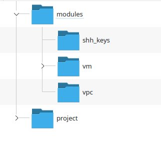

# Lab IBM 7-2 - Modules Continued

---

## Set Up

This lab is a continuation of the previous lab.

Each of the VM dependencies will have its own module. We will need two new modules. Note that we are not adding input `variables.tf` files to the new modules just to keep the lab simple, although we would do this in real life.

After the lab, a further exercise could be to add parameterize the new modules with `variables.tf`

Create the module folders for the ssh keys and the network



And place a copy of the `providers.tf` file in each module. 

## Shh keys module

Move the code that was in the vm module for the ssh keys resource into the ssh module as `main.tf`

```terraform
resource "ibm_is_ssh_key" "my_ssh_key" {
  name       = "lab2-key"
  public_key = "ssh-rsa AAAAB3NzaC1yc2EAAAADAQABAAABAQCKVmnMOlHKcZK8tpt3MP1lqOLAcqcJzhsvJcjscgVERRN7/9484SOBJ3HSKxxNG5JN8owAjy5f9yYwcUg+JaUVuytn5Pv3aeYROHGGg+5G346xaq3DAwX6Y5ykr2fvjObgncQBnuU5KHWCECO/4h8uWuwh/kfniXPVjFToc+gnkqA+3RKpAecZhFXwfalQ9mMuYGFxn+fwn8cYEApsJbsEmb0iJwPiZ5hjFC8wREuiTlhPHDgkBLOiycd20op2nXzDbHfCHInquEe/gYxEitALONxm0swBOwJZwlTDOB7C6y2dzlrtxr1L59m7pCkWI4EtTRLvleehBoj3u7jB4usR"
  type       = "rsa"
}
```

#### Return value

Create an `outputs.tf` file that return the id of the created key


```terraform
output "sshkeyid" {
    description = "Id of ssh key"
    value = ibm_is_ssh_key.my_ssh_key.id
}
```

## VPC module

Move the code for the VPC from the compute module into the VPC module and call the file `main.tf`

```terraform 
resource "ibm_is_vpc" "my_vpc" {
  name = "myvpc"
}

resource "ibm_is_subnet" "my_subnet" {
  name            = "mysubnet"
  vpc             = ibm_is_vpc.my_vpc.id
  zone            = "us-south-1"
  ipv4_cidr_block = "10.240.0.0/24"
}
```

What we need for the vm is the id of the subnet and the vpc id.  Create the `outputs.tf` file where this is returned

```terraform
output "subnetid" {
    description = "Id of subnet"
    value = ibm_is_subnet.my_subnet.id
}

output "vpcid" {
    description = "Id of vpc"
    value = ibm_is_vpc.my_vpc.id
}
```

## Compute module

We now need to add four variables so that we can pass the ids of the network, subnet and the keys

Add these to the `variables.tf`

```terraform
variable "vm_image" {
    description = "Image used for vm"
    type = string
}

variable "vm_profile" {
    description = "Profile used for vm"
    type = string
}

variable "keys_id" {
    description = "id for ssh keys"
    type = string
}

variable "subnet_id" {
    description = "id of the subnet used"
    type = string
}

variable "vpc_id" {
    description = "id of the vpc used"
    type = string
}

```

Modify the `compute.tf` to use these variables

```terraform
resource "ibm_is_instance" "my_vm" {
  name    = "mycompute"
  vpc     = var.vpc_id
  zone    = "us-south-1"
  image   = var.vm_image
  tags = ["source:vm module"]


profile = var.vm_profile
  

  primary_network_interface {
    subnet = var.subnet_id
  }

  keys = [
    var.keys_id
  ]
}

```

## Root Module

Now we have to add the two new modules and pass their return values to the compute module

In the `main.td` file add the following module calls and pass the three new variable values to the vm module.

```terraform
odule "vm" {
    source = "../modules/vm"
    vm_image = var.vm_image
    vm_profile = var.vm_profile
    subnet_id = module.vpc.subnetid
    keys_id = module.keys.keys.sshkeyid
    vpc_id = module.vpc.vpcid

}

module "keys" {
    source = "../modules/ssh_keys"
}

module "vpc" {
    source = "../modules/vpc"
}
```